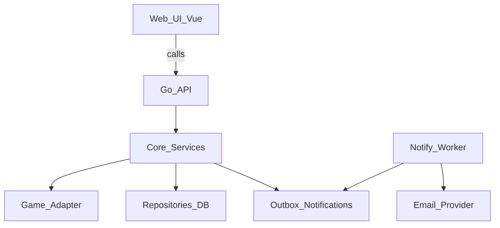

# 02 架构：Core + Game Adapter + Game Manifest

## 1. 目标

- 同一套“组队/开团/报名/排班/协作”能力，支持多游戏（WoW、FF14…）。
- 平台核心不写死任何游戏规则；新增游戏主要通过 **Adapter + Manifest + ScoreProvider** 方式扩展。
- Web 场景补齐“不可控转发”的差异：访问码/邀请链接。
- 通知系统 MVP 先做 Email，后续可扩展 Discord/Web Push。

## 2. 总体结构（Split Repo）

仓库：`d:/Workroot/meeting-stone-web/`

- `web/`：Vue3 + Vite + TS（按 Manifest 驱动 UI）
- `api/`：Go（Core + Adapter + Providers）
- `docs/`：PRD/架构/API/模型/通知/迁移/新增游戏

## 3. 核心概念

### 3.1 Core（通用领域层）

Core 负责通用流程与一致性：

- 活动：创建/更新/删除、可见性、访问控制、截止时间
- 报名：创建报名记录、状态变更（请假/取消/被移除）
- 报名组：管理与批量报名
- 阵容：读写阵容/槽位、批量保存、导出
- 协作：管理员（assistant）与社交（关注/黑名单）
- 通知：生成通知事件、写入 Outbox，交给异步投递

Core **不负责**：
- 职业/专长/职责的字典（由 adapter 提供）
- 评分计算/来源（由 ScoreProvider 提供）
- 不同游戏的队伍规模与阵容约束细节（由 adapter 提供）

### 3.1.1 gameKey 的粒度：用“规则集（ruleset）”划分

`gameKey` 的本质是一个 **规则集合**（ruleset），只要以下任意一点发生明显变化，就应拆分为不同 `gameKey`：

- 职业/专长/职责体系不同（jobs/specs/roles）
- 服务器/大区/阵营模型不同
- 评分来源与口径不同（WCL vs FFLogs vs 自定义）
- 队伍规模/阵容形态不同

以魔兽世界为例，建议使用不同 `gameKey`：

- `wow-retail`
- `wow-classic`（或更细：`wow-era` / `wow-sod` / `wow-cata` …）

并增加一个**聚合字段**用于 UI/统计（不参与业务隔离）：

- `game_family` / `parent_game_key`：统一为 `wow`

这样可以在 UI 上实现“魔兽世界 → 选择版本”，同时保持 Adapter/Manifest 的规则隔离清晰。

### 3.2 Game Adapter（游戏适配器）

每个 `gameKey` 对应一个 Adapter，实现该游戏的规则注入：

- **字典**：roles/jobs/specs/icons/colors、服务器/阵营模型
- **校验**：角色名规则、报名 payload 校验、限制规则解释
- **阵容能力**：
  - slot 约束（任意/职责/职业/专长/空位）
  - “同账号重复入队”策略（硬阻止/强提示/允许）
  - buff/团队组件（可选）
- **默认配置**：默认规模、默认网格模板、默认筛选项

### 3.3 Game Manifest（前端渲染契约）

前端通过 manifest 决定 UI：

- 选择器渲染：职业/专长/职责、图标与颜色
- 活动创建表单：是否展示服务器/阵营、规模选项、限制编辑器
- 报名表单：绑定角色 vs 自定义报名字段
- 阵容编排：网格尺寸、slot 约束选择器、统计展示（职责/近战远程）
- 团队Buff配置：Buff类型、图标、提供该Buff的专长列表

建议接口：
- `GET /api/v1/games`
- `GET /api/v1/games/{gameKey}/manifest`

Manifest 版本化建议：

- 同一 `gameKey` 内部的小幅变更（例如赛季/阶段导致的字典增量）优先使用：
  - `manifestVersion`（整数递增）
  - 或 `phase` / `effectiveFrom`（配置化）
- 只有当规则差异大到需要不同 Adapter 时，才拆新的 `gameKey`

### 3.4 团队Buff（Raid Composition）模块

对于支持团队Buff展示的游戏（如 WoW CTM/MOP/正式服），Manifest 需要定义：

```json
{
  "buffComposition": {
    "enabled": true,
    "categories": [
      {
        "id": "attack_power",
        "name": "攻击强度",
        "compact": "攻强",
        "icon": "ability_warrior_battleshout",
        "providedBy": [
          { "job": "Warrior", "spec": "*" },
          { "job": "DeathKnight", "spec": "Blood" }
        ]
      },
      {
        "id": "spell_power",
        "name": "法术强度",
        "compact": "法强",
        "icon": "spell_arcane_arcanepotency",
        "providedBy": [
          { "job": "Mage", "spec": "Arcane" },
          { "job": "Shaman", "spec": "Elemental" }
        ]
      }
    ]
  }
}
```

前端根据 Manifest 动态渲染团队Buff统计面板：
- 遍历 `buffComposition.categories`
- 检查当前阵容中是否有 `providedBy` 中的职业/专长
- 显示已激活/未激活状态

## 4. 请求与鉴权

### 4.1 认证与会话

你已选择：Email + OAuth（Battle.net/Discord/Google）

建议：
- Access Token（JWT，短有效期）
- Refresh Token（HttpOnly Cookie，长有效期）
- 中间件解析后写入 `context.user_id`

### 4.2 gameKey 作为隔离维度

所有业务 API 都以 `gameKey` 作为 path 参数：

- `GET /api/v1/games/{gameKey}/activities`
- `POST /api/v1/games/{gameKey}/activities/{id}/signup`

原因：
- 不依赖 header（代理/缓存/前端实现差异更少）
- 多租户/多游戏路由更清晰

## 5. 访问控制（Web 差异补齐）

### 5.1 模式

- `public`：公开可访问
- `private`：不在大厅，需链接访问（但仍可被扩散）
- `code`：访问码（存 hash）
- `invite`：邀请链接 token（可撤销/过期）

### 5.2 建议实现

- `access_code_hash`：argon2/bcrypt
- `invite_tokens`：单独表存储（token hash、name、expires_at、revoked_at、created_by）
- `activity_access_grants`：可选（记录用户已通过访问码校验的会话授权）

## 6. 通知系统（MVP=Email）

核心原则：
- 主链路只“记录要发什么”（Outbox），不直接发送
- Worker 异步发送，支持重试/幂等/死信

事件（MVP）：
- 截止提醒、管理员邀请、状态变更、活动变更

## 7. 关键数据流（高层）



## 8. 前端组件架构

### 8.1 目录结构

```
web/src/
├── api/                    # API 调用封装
│   ├── games.ts
│   ├── activities.ts
│   ├── signups.ts
│   └── lineups.ts
├── components/             # 通用组件
│   ├── common/            # 基础组件（Button, Modal, Input...）
│   ├── game/              # 游戏相关（JobIcon, SpecSelector...）
│   └── activity/          # 活动相关（ActivityCard, SignupList...）
├── composables/            # 组合式函数
│   ├── useAuth.ts
│   ├── useGameManifest.ts
│   └── useActivity.ts
├── pages/                  # 页面
│   ├── index/             # 首页（活动列表/大厅）
│   ├── activity/          # 活动详情
│   ├── lineup/            # 阵容编排
│   └── settings/          # 设置
├── stores/                 # Pinia 状态管理
│   ├── auth.ts
│   ├── game.ts
│   └── activity.ts
├── games/                  # 游戏特定逻辑（如有必要）
│   └── wow/
│       └── buffComposition.ts
└── utils/
    ├── date.ts            # 时区/日期处理
    └── score.ts           # 分数颜色编码
```

### 8.2 核心组件

#### GameDrivenPicker（Manifest 驱动选择器）

```vue
<template>
  <div class="game-driven-picker">
    <template v-if="type === 'job'">
      <div v-for="job in manifest.jobs" :key="job.key" @click="select(job)">
        
        <span :style="{ color: job.color }">{{ job.label }}</span>
      </div>
    </template>
    <!-- 其他类型：spec, role, server... -->
  </div>
</template>

<script setup>
const props = defineProps(['type', 'gameKey', 'value'])
const emit = defineEmits(['update:value'])
const { manifest } = useGameManifest(props.gameKey)
</script>
```

#### LineupGrid（阵容网格）

- 5 列 × N 行布局
- 拖拽支持（vuedraggable 或 @vueuse/core useDraggable）
- 角色卡片渲染
- 重复用户高亮
- 未指定本车警告

#### BuffCompositionPanel（团队Buff面板）

- 从 Manifest 读取 Buff 配置
- 根据当前阵容计算激活状态
- 点击未激活 Buff 触发筛选

### 8.3 状态管理

```typescript
// stores/game.ts
export const useGameStore = defineStore('game', {
  state: () => ({
    currentGameKey: 'wow-classic',
    manifests: {} as Record<string, GameManifest>,
  }),
  
  actions: {
    async loadManifest(gameKey: string) {
      if (!this.manifests[gameKey]) {
        const manifest = await api.getManifest(gameKey)
        this.manifests[gameKey] = manifest
      }
      return this.manifests[gameKey]
    }
  },
  
  getters: {
    currentManifest: (state) => state.manifests[state.currentGameKey]
  }
})
```

### 8.4 国际化与时区

```typescript
// composables/useI18n.ts
export function useActivityTime(deadlineUtc: string) {
  const { timezone, locale } = useUserSettings()
  
  return computed(() => {
    const date = new Date(deadlineUtc)
    return new Intl.DateTimeFormat(locale.value, {
      timeZone: timezone.value,
      dateStyle: 'full',
      timeStyle: 'short'
    }).format(date)
  })
}
```

## 9. 部署建议（阶段性）

MVP：
- `api`：单实例 + 计划任务（deadline reminder）+ worker（可同进程开 goroutine，后续拆分）
- `web`：静态部署（CDN）
- DB：MySQL/Postgres（二选一），Redis 可选（限流/会话/缓存）

后续：
- worker 拆独立进程
- 引入消息队列（如 NATS/RabbitMQ/SQS）或 DB 轮询 outbox（先简单后演进）

## 10. 安全考虑

### 10.1 认证安全

- Access Token 短有效期（15分钟）
- Refresh Token HttpOnly Cookie（7天）
- CSRF 保护（SameSite=Strict）

### 10.2 访问控制安全

- 访问码使用 bcrypt/argon2 存储
- 邀请链接 token 使用加密随机生成
- 访问授权记录可配置过期时间

### 10.3 反滥用

- 登录/报名接口限流（IP + 账号维度）
- 访问码验证限流（防暴力破解）
- 敏感词过滤（角色名/活动标题/备注）

